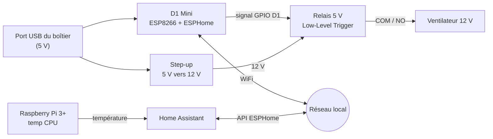
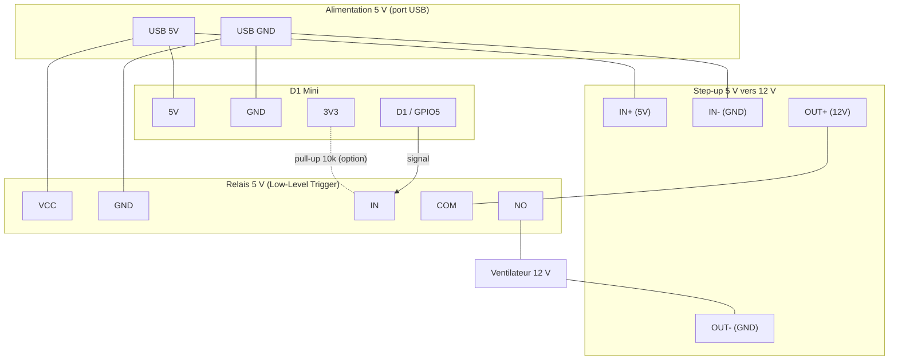
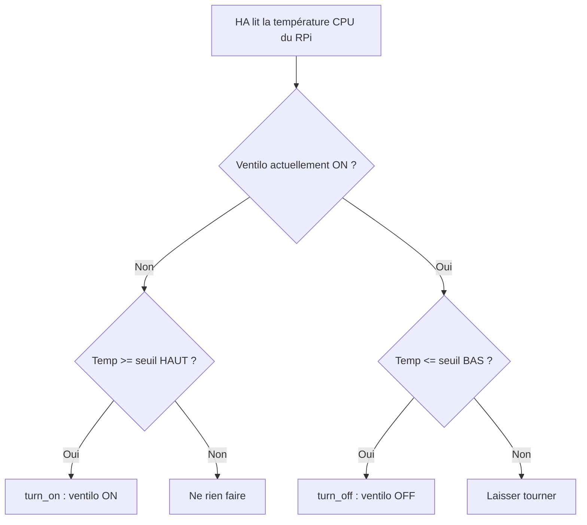
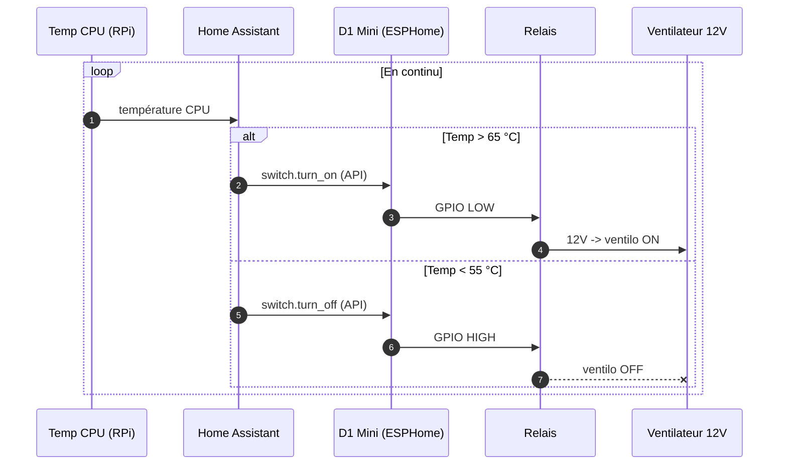

# 🌀 Contrôle d'un ventilateur de refroidissement — Boîtier Routeur 4G + Raspberry Pi 3+

> **Objectif** : piloter (allumer/éteindre) un ventilateur **12 V** déjà présent dans un boîtier
> contenant un routeur 4G et un Raspberry Pi 3+, pour favoriser la circulation d'air et éviter
> la surchauffe.
>
> ⚡ **Tout reste en très basse tension continue (5–12 V DC). Aucune commutation du 230 V.**

### ✅ Configuration retenue (d'après tes réponses)

| Paramètre | Choix |
|---|---|
| Ventilateur | **12 V** |
| Alimentation dispo dans le boîtier | **Port USB (5 V)** uniquement |
| Conséquence | ➕ **convertisseur step-up 5 V → 12 V** nécessaire pour le ventilo |
| Pilotage | **Home Assistant** (API ESPHome) — c'est HA qui régule, pas le RPi |
| Source de température | **CPU du Raspberry Pi** (pas de DS18B20) |
| DS18B20 | ❌ non retenu |

> ⚠️ **2 points à confirmer** (voir §12) : le **courant** de ton ventilo vs la capacité du **port
> USB**, et **où tourne Home Assistant** (sur ce RPi, ou sur une autre machine).

---

## 1. Matériel

### Ce que tu as déjà

| Élément | Rôle | Notes techniques |
|---|---|---|
| **D1 Mini Type‑C (ESP8266)** | « Cerveau » WiFi qui pilote le relais | Logique **3,3 V**, alim USB‑C (5 V). GPIO conseillé : **D1 = GPIO5**. |
| **Module 1‑Relais 5 V, Low‑Level Trigger, KF‑301** | Interrupteur électronique du ventilo | **Bobine 5 V**, **déclenchement à l'état BAS** (IN = 0 V → relais ON). Contacts vis : COM / NO / NC. |
| **Ventilateur 12 V** (dans le boîtier) | Brassage de l'air | ⚠️ note son **courant** (sur l'étiquette) — voir §6.2. |

### À ajouter (la pièce manquante + petits consommables)

- 🆕 **Convertisseur élévateur 5 V → 12 V** (step‑up), p. ex. **MT3608** (réglable) ou un **câble
  « USB → 12 V »** (sortie fixe 12 V, barillet 5,5×2,1 mm). ~2–4 €. **Indispensable** ici.
- **Câbles Dupont femelle‑femelle** (D1 Mini ↔ relais).
- **Résistance 10 kΩ** (pull‑up anti‑« tic » au démarrage — §6.5). *Recommandé.*
- **Domino / bornier ou soudure + gaine thermo** pour insérer le relais dans le fil 12 V du ventilo.
- *(Optionnel)* **Diode 1N4007** (roue libre) si le ventilo est un moteur 2 fils sans électronique.
- Adhésif double‑face / entretoises pour fixer les cartes.

---

## 2. Schéma de principe



**Flux** : Home Assistant surveille la **température CPU du Raspberry**. Quand ça chauffe, HA
demande au D1 Mini (via l'API ESPHome) d'activer le relais ; le relais laisse passer le **12 V**
(fourni par le step‑up alimenté en 5 V USB) vers le ventilateur. Le D1 Mini reste **indépendant** :
le ventilo reste pilotable même si le RPi redémarre.

---

## 3. ⚡ Le point d'alimentation (12 V depuis 5 V)

Ton ventilo est en **12 V** mais la seule source dispo est un **port USB en 5 V**. Deux façons
de fournir le 12 V :

1. **Step‑up 5 V → 12 V** (retenu) : un petit module élévateur transforme le 5 V USB en 12 V.
   Le relais commute ce 12 V vers le ventilo.
   - **Avantage** : n'utilise que ce que tu as (le port USB).
   - **À vérifier (important)** : le **courant**. Un step‑up tire côté 5 V environ
     `I₅ᵥ ≈ 2,8 × I_ventilo`. Exemple : ventilo 0,15 A @12 V → ~0,42 A sur le 5 V, **plus** le
     D1 Mini (~0,08 A) et la bobine du relais (~0,07 A) → **~0,6 A** au port USB. OK pour un port
     **1 A**, juste pour un port **0,5 A**. Si ton ventilo est gros/gourmand (>0,25 A), prévois un
     port USB ≥ 1 A, ou plutôt l'option 2.
2. **Alternative** : si le routeur est en fait alimenté en **12 V** et a de la marge, on peut y
   prélever le 12 V directement (sans step‑up). Ou ajouter un petit bloc 12 V dédié. (Tu avais
   indiqué « port USB » → on part sur le step‑up.)

> 💡 **Règle d'or câblage** : le courant du ventilo passe par le **step‑up → relais → ventilo**,
> **jamais à travers la carte D1 Mini**. Le 5 V USB alimente *en parallèle* le D1 Mini, la bobine
> du relais et l'entrée du step‑up.

---

## 4. Architecture de contrôle (Home Assistant)

Tu pilotes via **Home Assistant**. Le D1 Mini tourne sous **ESPHome** et s'intègre nativement à
HA (API chiffrée). **C'est HA qui décide** d'allumer/couper selon la température → pas besoin du
script de régulation sur le RPi.

### D'où vient la température ? (sans DS18B20)

Le signal le plus pertinent est la **température CPU du Raspberry Pi** du boîtier. Pour la rendre
visible dans HA, **selon où tourne Home Assistant** :

| Cas | Méthode pour obtenir la temp dans HA |
|---|---|
| **HA tourne SUR ce RPi 3+** | Intégration **System Monitor** → entité `sensor.processor_temperature`. Rien à coder. |
| **HA tourne ailleurs** (autre machine) | Le RPi **publie** sa temp : **MQTT** (script ci‑dessous, §8.3), ou intégration **Command Line/SSH**, **SNMP** ou **Glances**. |

➡️ On écrit l'automatisation HA en référençant une entité `sensor.<...>` ; il suffit d'adapter
son nom selon le cas.

---

## 5. Câblage

### 5.1 Schéma de câblage



### 5.2 Table de connexions

| Source 5 V (USB) | → | Vers |
|---|---|---|
| `USB 5V` | → | `D1 Mini 5V` **+** `Relais VCC` **+** `Step-up IN+` (en parallèle) |
| `USB GND` | → | `D1 Mini GND` **+** `Relais GND` **+** `Step-up IN-` |

| D1 Mini | → | Relais | Remarque |
|---|---|---|---|
| `D1` (GPIO5) | → | `IN` | Signal de commande |
| `3V3` | →(10 kΩ)→ | `IN` | **Pull‑up optionnel** anti‑tic (§6.5) |

| Côté 12 V (puissance) | Connexion |
|---|---|
| `Step-up OUT+` (12 V) | → `Relais COM` |
| `Relais NO` | → `Ventilo +` |
| `Ventilo -` | → `Step-up OUT-` (GND 12 V) |

> On utilise **COM + NO** : ventilo **coupé par défaut**, alimenté seulement quand le relais est activé.

### 5.3 Masses
Le step‑up est **non isolé** : son GND d'entrée (5 V) et de sortie (12 V) sont communs. Toutes les
masses (USB, D1 Mini, relais, step‑up, ventilo) sont donc **reliées entre elles** — c'est normal
et voulu. Les **contacts du relais** (COM/NO) restent eux des **contacts secs** : c'est uniquement
eux qui « coupent » le 12 V du ventilo.

---

## 6. Points techniques importants ⚠️

### 6.1 ⚠️ Le piège n°1 : « Low‑Level Trigger » piloté en 3,3 V

C'est **le point le plus délicat du montage** — un problème réel et bien documenté.
Le relais s'active quand `IN = 0 V`. Or le D1 Mini ne sort que **3,3 V** au niveau haut, tandis
que le `VCC` du module est à **5 V**. Au niveau haut, l'écart n'est que de 5 − 3,3 = **1,7 V**,
ce qui peut être **insuffisant pour bloquer franchement** l'étage d'entrée → le relais risque de
**ne pas retomber** (il « reste collé »).

Solutions, de la plus simple à la plus robuste :

1. **Teste d'abord tel quel** (`VCC` = 5 V, `IN` sur D1) : beaucoup de modules retombent quand
   même. Vérifie au montage (§10, étape 2) que `turn_off` coupe **vraiment** le relais.
2. **Si ton module a un cavalier `JD-VCC`** (souvent absent sur le 1‑canal, présent sur les
   2/4/8 canaux) : retire le cavalier, alimente **`JD-VCC` en 5 V** (la bobine) et **`VCC` en
   3,3 V** (la logique). L'entrée voit alors un vrai 0–3,3 V → coupure nette + isolation optocoupleur.
3. **Sinon, étage transistor** (NPN type 2N2222 / BC547) : `D1` → résistance 1 kΩ → base ;
   collecteur → `IN` ; émetteur → `GND`. La broche `IN` reçoit alors un vrai 0/5 V.
   ⚠️ Ce montage **inverse la logique** → dans ESPHome, **retire `inverted: true`**.
4. **Alternative propre** : un **module relais prévu pour 3,3 V** (les « 1‑canal 3,3 V low‑level
   trigger » existent) se pilote directement, sans aucune de ces précautions.

> 👉 En résumé : **teste ton module tel quel**. S'il ne retombe pas, applique l'option 2 (si
> cavalier `JD-VCC`) ou l'option 3 (transistor).

### 6.2 Régler le step‑up + budget courant
- Si tu prends un step‑up **réglable** (MT3608) : **règle la sortie à 12,0 V au multimètre AVANT
  de brancher le ventilo** (il sort une tension quelconque d'usine). Un câble « USB→12 V » à
  sortie fixe évite cette étape.
- **Vérifie le courant** : note le courant du ventilo sur son étiquette, et assure‑toi que le port
  USB peut fournir `≈ 2,8 × I_ventilo + 0,15 A` (voir §3). En cas de doute → port USB 1 A+.

### 6.3 ON/OFF seulement (pas de variation de vitesse)
Un relais ne fait que **tout ou rien** — parfait et fiable pour la gestion thermique. Pour une
vitesse variable **silencieuse**, il faudrait un MOSFET en PWM (§9), mais le ON/OFF suffit.

### 6.4 Hystérésis obligatoire (épargne le relais)
Un relais a une durée de vie limitée (~100 000 cycles) et **claque** à chaque bascule. On définit
**deux seuils** : allumer au‑dessus du **seuil HAUT**, n'éteindre qu'en dessous du **seuil BAS**
(§7). C'est exactement ce que fait l'automatisation HA.

### 6.5 Démarrage du D1 Mini (le « tic » au boot)
Avant que le firmware ne prenne la main, la broche GPIO **flotte** et peut brièvement déclencher
le relais (sans gravité, < 1 s). Pour l'éliminer : **résistance 10 kΩ de `IN` vers `3V3`** +
`restore_mode: ALWAYS_OFF` dans ESPHome.

---

## 7. Logique de régulation (hystérésis)

### 7.1 Logigramme



### 7.2 Diagramme d'états

```mermaid
stateDiagram-v2
    [*] --> Eteint
    Eteint --> Allume : Temp >= seuil HAUT
    Allume --> Eteint : Temp <= seuil BAS
    note right of Allume : Hystérésis : reste allumé tant que Temp > seuil BAS
```

### 7.3 Seuils conseillés

| Source | Seuil HAUT (ON) | Seuil BAS (OFF) | Remarque |
|---|---|---|---|
| **CPU du RPi 3+** *(ton cas)* | **65 °C** | **55 °C** | Le RPi 3+ throttle vers 80–85 °C → grosse marge, fonctionnement discret. |

---

## 8. Logiciel

### 8.1 Firmware du D1 Mini — ESPHome

```yaml
# ventilo-boitier.yaml
esphome:
  name: ventilo-boitier
  friendly_name: Ventilo Boitier 4G

esp8266:
  board: d1_mini

logger:

# API native ESPHome — REQUISE pour Home Assistant (la clé doit correspondre côté HA)
api:
  encryption:
    key: !secret api_key

ota:
  - platform: esphome           # forme LISTE requise depuis ESPHome 2024.6
    password: !secret ota_password

wifi:
  ssid: !secret wifi_ssid
  password: !secret wifi_password
  ap:                                   # point d'accès de secours
    ssid: "Ventilo-Boitier-Fallback"
    password: !secret ap_password

captive_portal:

web_server:                             # facultatif : test manuel (HA utilise l'API native)
  port: 80

switch:
  - platform: gpio
    name: "Ventilateur Boitier"
    id: ventilo
    pin:
      number: GPIO5        # = D1 sur le D1 Mini
      inverted: true       # ON = GPIO LOW (module Low-Level Trigger)
    restore_mode: ALWAYS_OFF   # ventilo éteint au démarrage
```

Après flash, HA détecte automatiquement l'appareil (intégration **ESPHome**) et expose l'entité
**`switch.ventilateur_boitier`**.

🔧 **Test manuel** (sans HA, via l'API REST du `web_server`) :

```bash
curl -X POST http://ventilo-boitier.local/switch/ventilateur_boitier/turn_on
curl -X POST http://ventilo-boitier.local/switch/ventilateur_boitier/turn_off
```

### 8.2 Automatisation Home Assistant (régulation + hystérésis)

```yaml
# Automatisation : ventilo selon la température CPU du RPi (hystérésis 65/55)
alias: Ventilo boitier - regulation thermique
trigger:
  - platform: numeric_state
    entity_id: sensor.rpi_boitier_cpu      # adapte au nom de TON entité (voir §4)
    above: 65
    id: chaud
  - platform: numeric_state
    entity_id: sensor.rpi_boitier_cpu
    below: 55
    id: froid
action:
  - choose:
      - conditions:
          - condition: trigger
            id: chaud
        sequence:
          - service: switch.turn_on
            target:
              entity_id: switch.ventilateur_boitier
      - conditions:
          - condition: trigger
            id: froid
        sequence:
          - service: switch.turn_off
            target:
              entity_id: switch.ventilateur_boitier
mode: single
```

#### Séquence



### 8.3 (Si HA tourne sur une AUTRE machine) — publier la temp du RPi via MQTT

Petit script sur le Raspberry du boîtier (nécessite `mosquitto-clients`) :

```bash
#!/usr/bin/env bash
# /usr/local/bin/rpi-temp-mqtt.sh — publie la temp CPU vers MQTT toutes les 30 s
BROKER="192.168.1.10"            # IP du broker MQTT (souvent Home Assistant)
TOPIC="boitier/rpi/cpu_temp"
while true; do
  raw=$(cat /sys/class/thermal/thermal_zone0/temp 2>/dev/null || echo 0)
  mosquitto_pub -h "$BROKER" -t "$TOPIC" -m "$(( raw / 1000 ))" 2>/dev/null
  sleep 30
done
```

Côté Home Assistant (`configuration.yaml`) :

```yaml
mqtt:
  sensor:
    - name: "RPi Boitier CPU"
      state_topic: "boitier/rpi/cpu_temp"
      unit_of_measurement: "°C"
      device_class: temperature
```

L'entité devient `sensor.rpi_boitier_cpu` (le nom utilisé dans l'automatisation §8.2). Lance le
script au démarrage via un service systemd (`Restart=always`).

> **Si HA tourne SUR ce RPi** : oublie le MQTT, active l'intégration **System Monitor** et utilise
> directement `sensor.processor_temperature` dans l'automatisation.

---

## 9. Pour aller plus loin (évolutions)

- **Vitesse variable & silence** : remplacer le relais par un **MOSFET logique** (ex. IRLZ44N,
  ou une carte AO3400) piloté en **PWM** côté 12 V → plus de claquement, plus d'usure, vitesse
  proportionnelle à la température. (HA/ESPHome gèrent le `fan` + PWM nativement.)
- **DS18B20 plus tard** (si tu changes d'avis) → régulation **autonome** par le D1 Mini, sans
  dépendre de HA ni du RPi :
  ```yaml
  one_wire:
    - platform: gpio
      pin: GPIO4                 # D2 — + résistance 4,7 kΩ entre DATA et 3V3 (obligatoire)
  sensor:
    - platform: dallas_temp
      name: "Température Boitier"
      id: temp_boitier
      update_interval: 30s
      on_value_range:
        - above: 40.0
          then: { switch.turn_on: ventilo }
        - below: 35.0
          then: { switch.turn_off: ventilo }
  ```
- **Variante sans Home Assistant** : un script sur le RPi lit `/sys/class/thermal/thermal_zone0/temp`
  et appelle l'API REST du D1 Mini (`curl -X POST .../turn_on|off`) avec la même hystérésis 65/55,
  lancé en service systemd. (Utile en secours si HA est indisponible.)
- **Tableau de bord HA** : graphe de température + interrupteur manuel + notification si la temp
  dépasse un seuil critique malgré le ventilo.

---

## 10. Procédure de montage & tests (checklist)

1. **Flasher le D1 Mini** sous ESPHome ; vérifier qu'il apparaît dans Home Assistant.
2. **Hors 12 V**, câbler `VCC` / `GND` / `IN` (5 V). Depuis HA (ou `curl`), tester `turn_on` /
   `turn_off` : la **LED du relais** et le **« clic »** doivent répondre — et surtout vérifier
   que `turn_off` **coupe bien** (sinon → §6.1).
3. **Régler le step‑up à 12,0 V** au multimètre (sortie **à vide**, ventilo débranché).
4. Au **multimètre** (continuité), vérifier `COM–NO` : **fermé** quand ON, **ouvert** quand OFF.
5. Couper, insérer le relais dans la ligne 12 V : `Step-up 12V → COM`, `NO → Ventilo+`,
   `Ventilo- → Step-up GND`.
6. Remettre sous tension : tester ON/OFF, le ventilo doit **démarrer / s'arrêter** franchement.
7. **Au boot du D1 Mini**, vérifier l'absence de démarrage intempestif prolongé ; si « tic »
   gênant → **pull‑up 10 kΩ** (`IN` → `3V3`).
8. Mettre en place la **source de température** (System Monitor ou MQTT, §4/§8.3) puis
   l'**automatisation HA** (§8.2). Valider en charge (ex. `stress-ng --cpu 4` sur le RPi).
9. **Surveiller la conso au port USB** sous charge (ventilo + step‑up) : pas de reset du D1 Mini
   ni du RPi. Sinon → port USB plus costaud ou alim 12 V dédiée.

---

## 11. Sécurité & bonnes pratiques

- ✅ **Très basse tension** (5–12 V DC) — aucun 230 V.
- ✅ **Courant du ventilo : jamais à travers la carte D1 Mini** (il passe par step‑up → relais → ventilo).
- ✅ **Budget du port USB** : `≈ 2,8 × I_ventilo + ~0,15 A`. Marge si possible.
- ✅ **Hystérésis** (65/55) pour épargner le relais.
- ✅ **Sens du flux d'air** : ventilo en **extraction** (aspire l'air chaud dehors), avec une
  **entrée d'air** opposée. Grille/filtre si poussiéreux.
- ✅ **Diode de roue libre** : la bobine du relais a déjà la sienne. Pour un moteur **2 fils** sans
  électronique, ajoute une **1N4007** en parallèle du ventilo (cathode côté `+`).
- ✅ **Fixation propre** : entretoises/adhésif, fils loin des pales, pas de court‑circuit.
- ✅ **Régler le step‑up à vide** (ventilo débranché) pour ne pas envoyer une surtension au ventilo.

---

## 12. Points à confirmer

1. **Courant du ventilo** (étiquette : ex. « 12 V 0,12 A ») **et** capacité du **port USB**
   utilisé (0,5 A ? 1 A ? 2 A ?) → pour valider le budget du §3 (ou décider d'une alim 12 V dédiée).
2. **Où tourne Home Assistant** : **sur ce Raspberry Pi 3+** (→ intégration System Monitor,
   `sensor.processor_temperature`) ou **sur une autre machine** (→ MQTT du §8.3) ?

Donne‑moi ces 2 infos et je te fige l'entité de température exacte + le budget d'alimentation. 🔧

---

*Document généré pour le projet « ventilo boîtier 4G » — config : ventilo 12 V via step‑up 5 V USB,
pilotage Home Assistant sur température CPU du Raspberry. Tout en basse tension DC.*
