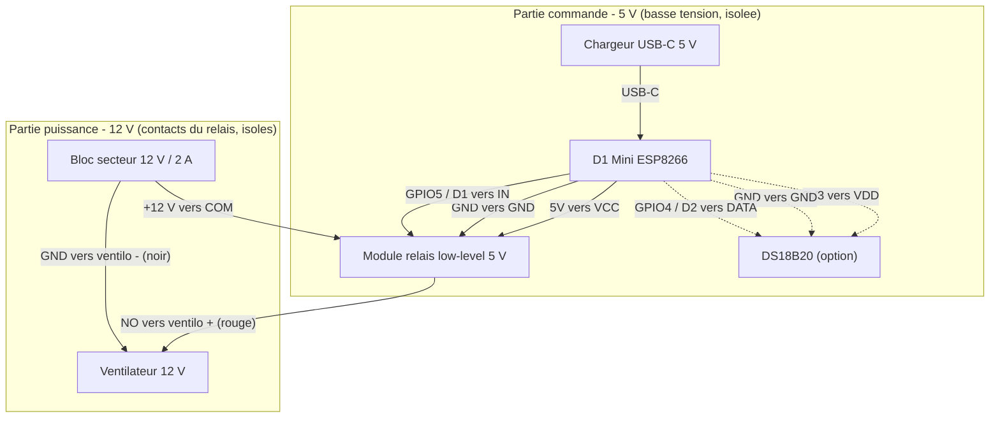

# Contrôle d'un ventilateur de boîtier avec ESPHome

Pilotage d'un ventilateur dans un boîtier contenant un **routeur 4G** + un **Raspberry Pi 3B+**, afin d'améliorer la circulation d'air et d'éviter la surchauffe. Le ventilateur est commuté par un **Wemos D1 Mini (ESP8266)** sous **ESPHome** via un module relais, avec une régulation automatique par température optionnelle (sonde DS18B20).

> **Hypothèse de tension** — Ce guide part d'un **ventilateur 12 V** alimenté par le bloc secteur 12 V / 2 A.
> Si le ventilateur est en **5 V**, seule la *partie puissance* change (voir la variante plus bas) ; la *partie commande* reste identique.

---

## 1. Matériel

| Élément | Rôle |
|---|---|
| Wemos D1 Mini (ESP8266, USB-C) | Microcontrôleur + WiFi |
| Module 1 relais **low-level** 5 V (bornier KF-301) | Commutation du ventilateur |
| Bloc secteur **12 V / 2 A** (prise EU) | Alimentation du ventilateur |
| Ventilateur **12 V** (déjà en place) | Refroidissement |
| Chargeur **USB-C 5 V** | Alimentation du D1 Mini |
| *(option)* Sonde **DS18B20** + résistance **4,7 kΩ** | Mesure de température → thermostat autonome |

**Rappel des broches du D1 Mini** : sur l'ESP8266, le marquage ne correspond pas au numéro GPIO.
- Broche marquée **`D1`** = **`GPIO5`** → utilisée pour le relais
- Broche marquée **`D2`** = **`GPIO4`** → utilisée pour la sonde DS18B20

---

## 2. Schéma de câblage



### Partie commande (toujours identique)

| De | Vers |
|---|---|
| D1 Mini `5V` | Relais `VCC` |
| D1 Mini `GND` | Relais `GND` |
| D1 Mini `D1` (= GPIO5) | Relais `IN` |

Alimentation du D1 Mini : câble **USB-C** vers un chargeur 5 V (ou un port USB libre).

### Partie puissance (ventilateur 12 V, isolée par le relais)

| De | Vers |
|---|---|
| Bloc 12 V `+` | Relais `COM` |
| Relais `NO` | Ventilateur `+` (fil rouge) |
| Bloc 12 V `–` | Ventilateur `–` (fil noir) |
| Relais `NC` | non utilisé |

### Points importants

- Le 12 V du ventilateur passe **uniquement** par les contacts du relais (`COM` / `NO`), **jamais** par le D1 Mini.
- Les contacts du relais étant isolés de la commande, **ne pas relier** la masse 12 V à la masse 5 V.
- Respecter la **polarité** du ventilateur DC (rouge = +, noir = –), sinon il ne tourne pas.

> **Variante ventilateur 5 V** : remplacer le bloc 12 V par une source 5 V (le bloc 12 V devient inutile), relier `COM` au +5 V et le `–` du ventilateur au GND 5 V. Le reste ne change pas.

---

## 3. Option recommandée : sonde DS18B20

Pour une vraie protection anti-surchauffe **autonome** (l'ESP décide seul, sans dépendre de Home Assistant), ajouter une DS18B20 :

| DS18B20 | Vers |
|---|---|
| VDD (rouge) | D1 Mini `3V3` |
| GND (noir) | D1 Mini `GND` |
| DATA (jaune) | D1 Mini `D2` (= GPIO4) |

⚠️ Ajouter **une résistance de 4,7 kΩ entre DATA et 3V3** (indispensable au bon fonctionnement du bus 1-Wire).

---

## 4. Script ESPHome

> **Conseil pour éviter les erreurs de clés** : crée d'abord l'appareil dans le **dashboard ESPHome**. Il génère automatiquement les blocs `esphome` / `esp8266` / `api` / `ota` / `wifi`. Tu n'as ensuite qu'à **coller les blocs `switch` / `one_wire` / `sensor` / `interval`** ci-dessous.

```yaml
# === ventilo-boitier.yaml ===
# Bloc généré automatiquement par le dashboard (ne pas recopier les clés à la main) :
esphome:
  name: ventilo-boitier
  friendly_name: Ventilo boîtier

esp8266:
  board: d1_mini

logger:

api:
  encryption:
    key: "genere_par_le_dashboard"

ota:
  - platform: esphome
    password: "genere_par_le_dashboard"

wifi:
  ssid: !secret wifi_ssid
  password: !secret wifi_password
  ap:
    ssid: "Ventilo-Boitier"
    password: "secours1234"

captive_portal:

# ---- À partir d'ici : les blocs à ajouter ----

# Relais = ventilateur. Brancher IN sur la broche marquée "D1" (= GPIO5).
switch:
  - platform: gpio
    name: "Ventilateur"
    id: relais_ventilo
    pin:
      number: GPIO5          # = D1 sur le D1 Mini
      inverted: true         # module LOW-level : "ON" = broche à la masse
    restore_mode: RESTORE_DEFAULT_ON   # au reboot : ventilo ON par défaut (sécurité)

# ==========================================================
#  FACULTATIF : sonde DS18B20 -> thermostat autonome.
#  Supprime one_wire + sensor + interval si tu ne mets pas de sonde.
#  DATA sur la broche "D2" (= GPIO4) + résistance 4,7 kΩ entre DATA et 3V3.
# ==========================================================
one_wire:
  - platform: gpio
    pin: GPIO4               # = D2 sur le D1 Mini
    id: bus_1wire

sensor:
  - platform: dallas_temp
    one_wire_id: bus_1wire
    name: "Température boîtier"
    id: temp_boitier
    update_interval: 30s
    # address: 0x...         # à compléter avec l'adresse lue dans les logs

# Régulation robuste : ré-évaluée toutes les 30 s.
# > 50 °C -> ventilo ON ; < 45 °C -> ventilo OFF ; entre les deux -> garde l'état actuel.
interval:
  - interval: 30s
    then:
      - if:
          condition:
            sensor.in_range:
              id: temp_boitier
              above: 50.0
          then:
            - switch.turn_on: relais_ventilo
      - if:
          condition:
            sensor.in_range:
              id: temp_boitier
              below: 45.0
          then:
            - switch.turn_off: relais_ventilo
```

Fichier **`secrets.yaml`** :

```yaml
wifi_ssid: "NomDeTonWiFi"
wifi_password: "MotDePasseWiFi"
```

### Pourquoi cette régulation par `interval`

Le déclencheur `on_value_range` ne réagit qu'au *franchissement* d'un seuil (passage de l'extérieur vers l'intérieur de la plage). Si le ventilateur est coupé manuellement alors qu'il fait déjà 55 °C, le seuil « > 50 °C » ne se redéclenche pas et le boîtier n'est plus protégé.

La version `interval` **ré-évalue l'état toutes les 30 s** : elle réaffirme toujours la bonne consigne, même après une action manuelle. L'hystérésis 45–50 °C évite que le relais claque sans arrêt autour du seuil. Ajuster les valeurs selon la température réelle relevée.

**Sécurité en cas de panne de sonde** : si la DS18B20 renvoie une valeur invalide (débranchée, erreur), les deux conditions sont fausses → le ventilateur reste sur son état par défaut (**ON**). La panne se fait du bon côté.

---

## 5. Procédure complète

1. **Câbler hors tension**, rien branché sur le secteur, selon les tables ci-dessus.
2. **Installer ESPHome** : soit l'add-on dans Home Assistant (le plus simple si HA est déjà en place), soit ESPHome en standalone (`pip install esphome` ou via Docker). Créer le `secrets.yaml` avec le WiFi.
3. Dans le dashboard ESPHome, **« New device »** → choisir le D1 Mini (ESP8266) → il génère l'en-tête. Ouvrir le YAML et **coller les blocs** `switch` (+ `one_wire` / `sensor` / `interval` si sonde).
4. **Premier flash en USB** : brancher le D1 Mini en USB-C à l'ordinateur (câble USB **data**, pas un câble charge seule). Possibilité aussi de flasher depuis le navigateur via `web.esphome.io` (Chrome/Edge). **Ensuite, toutes les mises à jour se font en OTA par WiFi** — plus besoin de câble.
5. **Lire les logs** dans le dashboard : vérifier la connexion WiFi et, si sonde, relever l'**adresse** du capteur. La recopier dans le champ `address:` puis reflasher en OTA (plus fiable que l'auto-détection).
6. **Ajouter à Home Assistant** (intégration ESPHome, appareil auto-découvert) — utile pour le contrôle manuel et les graphes de température. *Facultatif si seul le thermostat embarqué est utilisé.*
7. **Tester** : forcer l'état du relais ON/OFF. On doit entendre le « clic » du relais et voir le ventilateur tourner. Vérifier le **sens du flux d'air** (extraction de l'air chaud ou flux traversant).
8. **Intégrer dans le boîtier** : fixer le D1 Mini et le relais, isoler les borniers, orienter le ventilateur.

---

## 6. Sécurité et points de qualité

- Tout est en **5 V / 12 V continu** : aucun 230 V, donc pas de risque d'électrocution. La seule erreur à éviter est de faire passer le 12 V ailleurs que par les contacts du relais.
- **Démarrage** : avec un module low-level, le relais peut « coller » une fraction de seconde au boot avant qu'ESPHome prenne la main. Sans gravité pour un ventilateur. Pour l'éviter, ajouter une **résistance 10 kΩ entre IN et 3V3** (garantit l'état OFF au démarrage).
- **3,3 V vs 5 V** : piloter ce module 5 V avec les 3,3 V de l'ESP fonctionne dans l'immense majorité des cas (on garde `VCC` en 5 V pour que la bobine colle). Si le relais ne retombe pas franchement, la même résistance 10 kΩ vers 3V3 règle le souci.
- **`restore_from_flash`** : il existe une option `esp8266: restore_from_flash: true` pour conserver l'état après une coupure secteur, mais elle est **déconseillée ici** car le ventilateur bascule souvent (usure de la flash). Le défaut « ON au démarrage » suffit comme sécurité.

---

## 7. Notes de vérification (doc officielle ESPHome)

Éléments confirmés :

- `board: d1_mini` : bon identifiant PlatformIO sous `esp8266:`.
- OTA en liste avec `- platform: esphome` : syntaxe actuelle.
- `inverted: true` : correct pour un relais **low-level** (la broche est mise à la masse à l'état ON).
- `one_wire:` + `dallas_temp` (avec `one_wire_id`) : syntaxe à jour pour la DS18B20.
- `RESTORE_DEFAULT_ON` : valeur valide de `restore_mode`.
- Correspondance des broches : `D1` = `GPIO5`, `D2` = `GPIO4`.

Correction apportée par rapport à une première version : remplacement de `on_value_range` par une régulation `interval` + `sensor.in_range`, plus robuste pour une protection anti-surchauffe (voir section 4).
